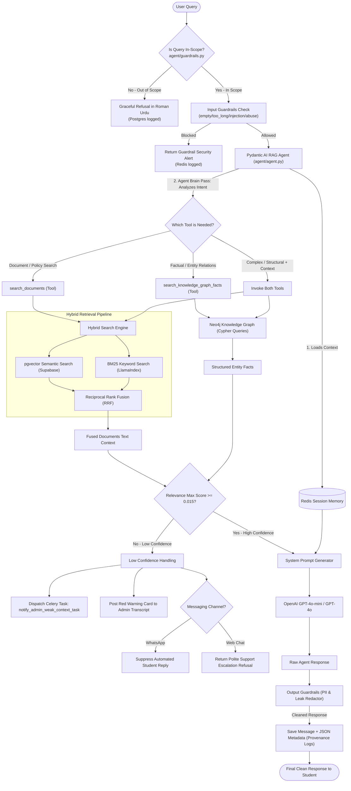
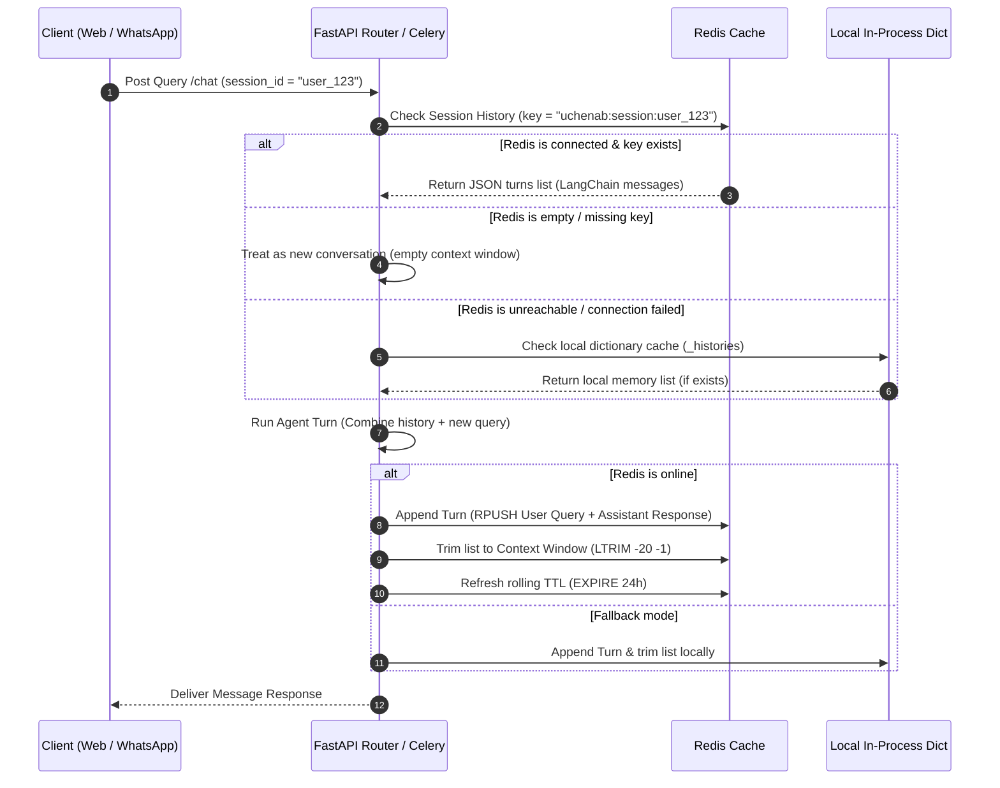
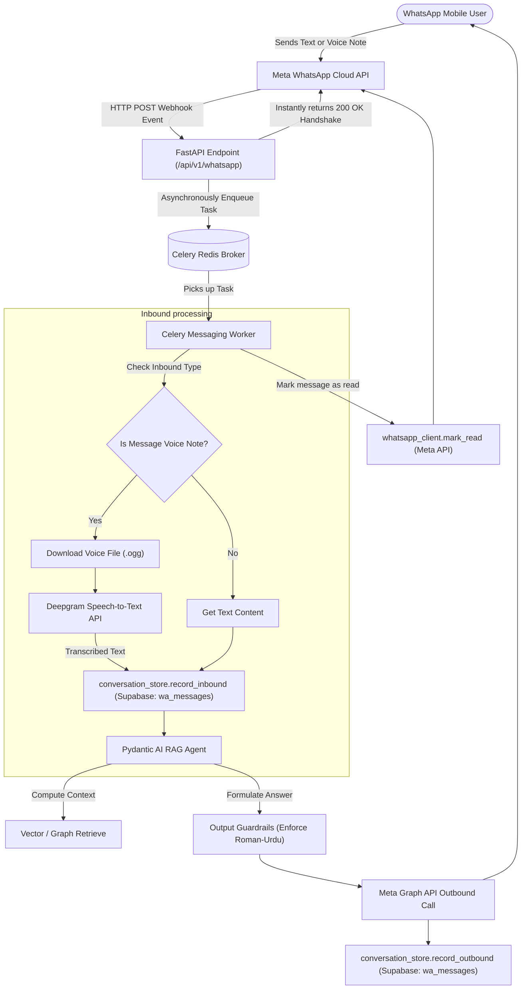
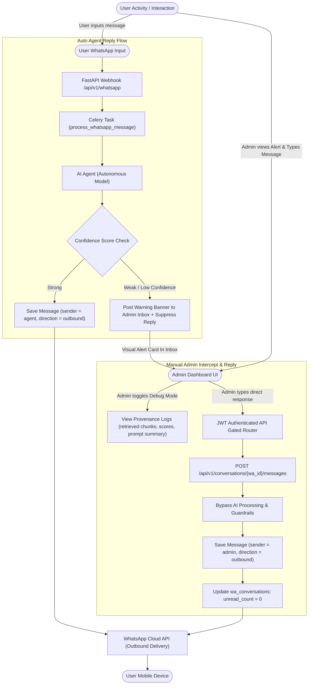
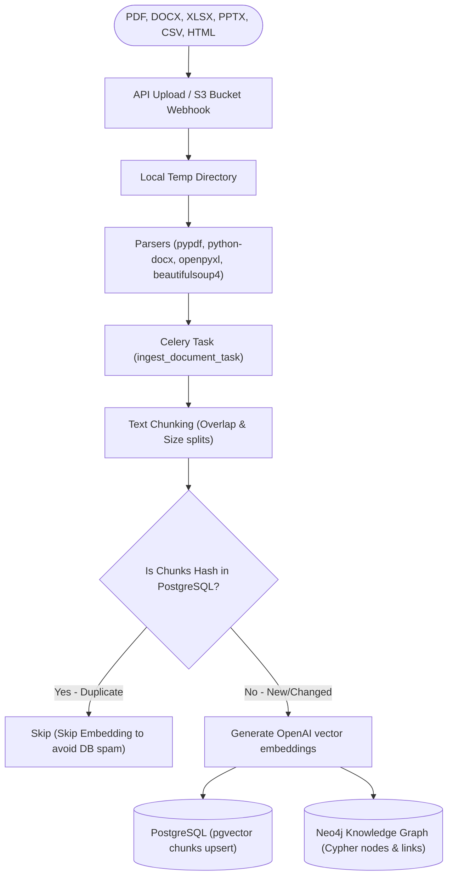

# Uchenab RAG — Enterprise Backend Services


The **Uchenab University Assistant** backend is a state-of-the-art, enterprise-grade AI engine designed to assist university students and applicants. Powered by **Pydantic AI** and **FastAPI**, it leverages a dual-retrieval pipeline—combining semantic cosine searches in **Supabase pgvector** and **LlamaIndex BM25** keyword queries—fused with a structural **Neo4j Knowledge Graph**. 

The system features real-time asynchronous background pipelines running on **Celery + Redis**, integrating **Meta WhatsApp Cloud APIs**, **Deepgram** voice note translation, strict guardrails (Roman-Urdu translation, prompt injection filters, and CNIC/PII redaction), and robust connection caching.

---

## 🏗️ Architectural Blueprints

### 1. Detailed Agentic RAG Flow
The RAG pipeline retrieves and fuses context from both vector search and structured graph networks before serving the query to OpenAI GPT-4o.



---

### 2. Session Memory Lifecycle (Redis Cache)
Conversation history is preserved across stateless workers in a high-speed sliding-window Redis structure, failing back gracefully to in-process memory if Redis is offline.



---

### 3. WhatsApp Messaging & Voice Loop
Voice and text events from the Meta Graph API webhook are offloaded immediately to background queues to return a fast `200 OK` handshake response, logging transactions to Supabase and issuing read receipts.



---

### 4. Agent Message vs. Admin Message Flows
AI automated workflows run independently from administrative manual intercepts inside the dashboard portal, unified through the outbound delivery endpoint.



---

### 5. Document Ingestion Pipeline
When files are added manually or synced periodically from S3, the pipeline processes and registers the metadata structure.



---

## 📚 References & Developer Documentation
To deep-dive into endpoints testing strategies or to check the QA test matrices, refer to our comprehensive internal documentation:
* 📄 **[API Testing Guide](apitesting.md)**: Detailed step-by-step specifications of all REST operations, Celery hooks, auth handshakes, and postman testing guidelines.
* 📋 **[QA Test Cases Log](testcases.md)**: Fully granular testing matrices, expected assertions, input/output boundary cases, and performance criteria log.

---

## 🛠️ Ingestion & Setup

### Service Map
* `api`: FastAPI application, serving all routes under `/api/v1/*` (port `8058`).
* `worker`: Celery worker performing voice processing, ingestion, and RAG execution.
* `beat`: Celery scheduler driving periodic 15-minute S3 synchronizations.
* `redis`: High-speed message broker, Celery backend, and endpoint/avatar cache store.

---

### 🚀 Running with Docker (Recommended)

1. Set up configurations:
   ```bash
   cp .env.example .env
   ```
2. Build and run all services:
   ```bash
   docker compose up --build
   ```
3. Access API Documentation at [http://localhost:8058/api/docs](http://localhost:8058/api/docs).

---

### 💻 Local (Non-Containerized) Setup

Ensure **PostgreSQL**, **Neo4j**, and **Redis** servers are running locally.

1. Initialize a Python virtual environment:
   ```bash
   python -m venv .venv
   source .venv/bin/activate
   ```
2. Install dependencies:
   ```bash
   pip install -r requirements.txt
   ```
3. Run the services across separate terminals:
   * **Terminal 1 (API)**:
     ```bash
     python -m uvicorn agent.api:app --reload --port 8058
     ```
   * **Terminal 2 (Celery Worker)**:
     ```bash
     celery -A worker.celery_app:celery_app worker -Q ingestion,messaging --loglevel=info
     ```
   * **Terminal 3 (Celery Scheduler)**:
     ```bash
     celery -A worker.celery_app:celery_app beat --loglevel=info
     ```

---

## 🧪 Testing Suite
Execute the testing framework using a clean container build:
```bash
docker run --rm -v "$(pwd)":/app -w /app uchenab-backend:latest python -m pytest -q
```
